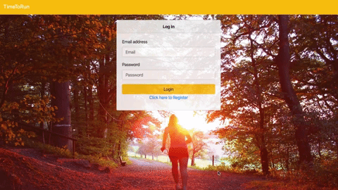
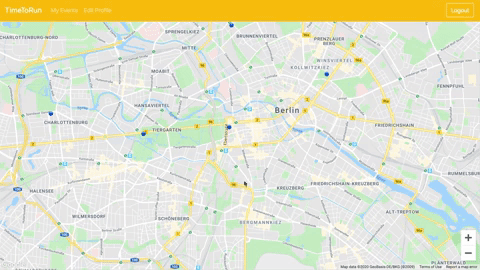
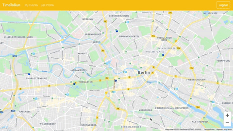

# RunTime
Runtime is a website dedicated to people who believe that running together is funnier than running alone. The main feature of this application is to create an event on a map or join an already existing one. Runtime is a single-page app created with React using the Google Maps API and following the Redux architecture.

**Tools:**
- React.js
- Redux
- Google Maps API
- Javascript
- Bootstrap
- PostgreSQL
- Node.js

**Login/Registration:**

**Dashboard of Organized and Participating Events:**

**Create Event:**

**Join Event:**

